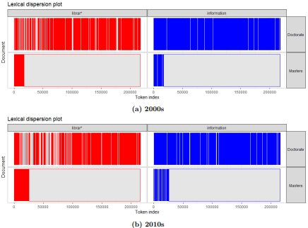

# Metadata (1921-2020) {data-orientation="rows"}

<iframe src="https://infogram.com/choropleth-map-of-pqdt-global-etds-for-us-states-1921-2020-1h7v4pjelmy84k0?live:showVizHome=no&amp;:embed=true" width="500" height="700">

</iframe>

<iframe src="https://public.tableau.com/views/meta_16613991789930/Dashboard1?::showVizHome=no&amp;:embed=true" width="730" height="700">

</iframe>

# EDA (1957-2020) {.storyboard}

### Words Distribution of Abstracts

<p float="left">

  

</p>

### Sentiment Distribution of Abstracts

<p float="left">

 

</p>

### N-Gram Analysis

<p float="left">

  

</p>

### Parts of Speech


# Doctorate--Masters Analysis (1957-2020) {.storyboard}

### Pages

<iframe src="https://public.tableau.com/views/degmeta/Sheet1?::showVizHome=no&amp;:embed=true" width="930" height="500">

</iframe>

------------------------------------------------------------------------

Plot shows the number of pages published by masters and doctorate scholars over the years in the database.

### Lexical Dispersion Plot (1950s-2010s)

<p float="left">

 

</p>

### Relative Frequency (1950s-2010s)

<p float="left">

 

</p>

### Geographical & University-wise Analyses

<iframe src="https://infogram.com/untitled-infographic-1h984wzn5xnz4p3?live:showVizHome=no&amp;:embed=true" width="930" height="500">

</iframe>

------------------------------------------------------------------------

Here you see the following visualizations - Cholorpeth maps for the distribution of ETDs according to degree type - Top universities that submitted the highest number of doctorate ETDs to the database - Top universities that submitted the highest number of masters ETDs to the database

### Prominent Mentors

<p float="left">


</p>

# Topic Analysis (1957-2020) {data-orientation="rows"}

<iframe src="https://public.tableau.com/views/dash_16612310430200/Dashboard1?:showVizHome=no&amp;:embed=true/" width="1283" height="700">

</iframe>

```{r global, include=FALSE}
# load data
library(DT)
library("shiny")

data <- read.csv(url("https://raw.githubusercontent.com/manika-lamba/phd/main/storyboard/data.csv?token=GHSAT0AAAAAACHQMUJF7NO7S3NUWDSGEDDKZICJF7A"))
data <- data.frame(data)
```

# Topic Data {data-orientation="rows"}

## Column {.sidebar}

**Search**

```{r}
selectInput("Topic", label = 'Topic:', choices = unique(data$Topic))
      selectInput("Type", label = 'Type:', choices = unique(data$Type))

```

**Download selected data here**

```{r}
downloadButton("downloadNormal",label = "Download the data", class = "butt1")

downloadHandler(
  filename = function() {
    "output.csv"
  },
  content = function(file) {
    write.csv(dataset(), file, row.names = FALSE)
  }
)

```

## Column

### Result Output

```{r}
data <- read.csv("C:\\Users\\Harkirat Singh Lamba\\Desktop\\PhD_ML\\Searchable database FINAL results\\working_shinyapp\\data_new.csv")
data <- data.frame(data)
dataset <- reactive({
    return(subset(data, (Topic == input$Topic & Type == input$Type)))
  })
  output$mydata <- renderDataTable(dataset(), options = list(scrollX = T))

dataTableOutput('mydata')

```

# Predict the Category {data-orientation="rows"}


## Column

### Screen

You can tag your input CSV file of theses and dissertations with **Library Science, Archival Studies**, and **Information Science** categories. The screen will show the output on screen.

<iframe>
	src="https://manika07-etds.hf.space"
	frameborder="0"
	width="1200"
	height="450"
</iframe>

